# Busy Beans Backend - ERD and Flow Diagrams

**Generated:** December 11, 2025  
**Project:** Busy Beans Coffee Distribution Platform

---

## 📊 Complete Entity Relationship Diagram (ERD)

### Full Database Schema with All Relationships

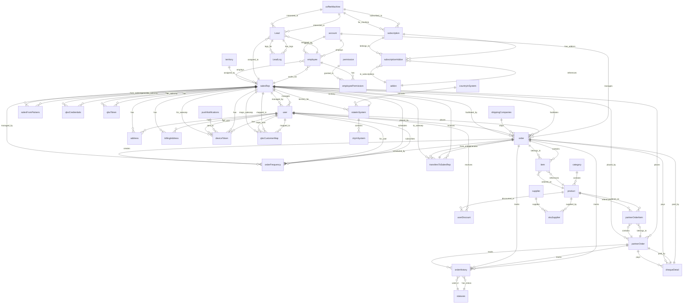

---

## 🔄 Complete Order Processing Flow

### Detailed Order Lifecycle

```mermaid
flowchart TD
    Start([Customer Places Order]) --> Validate{Validate Order Data}
    Validate -->|Invalid| Error1[Return Error]
    Validate -->|Valid| Calculate[Calculate Pricing]

    Calculate --> CalcItems[Calculate Items Price]
    CalcItems --> CalcDiscount[Apply Discounts]
    CalcDiscount --> CalcShipping[Calculate Shipping Charges]
    CalcShipping --> CalcVAT[Add VAT]
    CalcShipping --> CalcTotal[Calculate Total Bill]

    CalcTotal --> CreateOrder[Create Order Record]
    CreateOrder --> CreateItems[Create Order Items]
    CreateItems --> CreateHistory[Create Order History Entry]
    CreateHistory --> GenInvoice[Generate Invoice Number]

    GenInvoice --> Payment{Payment Method?}

    Payment -->|Stripe| StripeFlow[Stripe Payment Flow]
    Payment -->|Invoice| InvoiceFlow[Invoice Flow]
    Payment -->|Check| CheckFlow[Check Flow]

    StripeFlow --> CreateIntent[Create Payment Intent]
    CreateIntent --> Charge[Charge Customer]
    Charge -->|Success| UpdatePaid[Update Payment Status = done]
    Charge -->|Failed| UpdatePending[Update Payment Status = pending]

    InvoiceFlow --> SetTerms[Set Invoice Terms Net 30/60/90]
    SetTerms --> SetReminder[Set Invoice Reminder Date]
    SetReminder --> UpdatePending

    CheckFlow --> RecordCheck[Record Check Details]
    RecordCheck --> UpdatePending

    UpdatePaid --> SendEmail1[Send Order Confirmation Email]
    UpdatePending --> SendEmail1

    SendEmail1 --> AssignSupplier{Assign Supplier?}
    AssignSupplier -->|Yes| NotifySupplier[Notify Supplier]
    AssignSupplier -->|No| WaitAssignment[Wait for Assignment]

    NotifySupplier --> SupplierAck{Supplier Acknowledges?}
    SupplierAck -->|Yes| UpdateAck[Update Order Status]
    SupplierAck -->|No| WaitAck[Wait for Acknowledgment]

    UpdateAck --> Dispatch{Order Dispatched?}
    Dispatch -->|Yes| AddTracking[Add Tracking Number]
    AddTracking --> UpdateDispatch[Update Order Status]
    UpdateDispatch --> SendDispatchEmail[Send Dispatch Email]
    SendDispatchEmail --> Delivery{Order Delivered?}

    Delivery -->|Yes| UpdateDelivered[Update Order Status = Delivered]
    Delivery -->|No| WaitDelivery[Wait for Delivery]

    UpdateDelivered --> SyncQBO{QuickBooks Connected?}
    SyncQBO -->|Yes| SyncInvoice[Sync Invoice to QBO]
    SyncQBO -->|No| SkipQBO[Skip QBO Sync]

    SyncInvoice --> CalcCommission{Has Sales Rep?}
    CalcCommission -->|Yes| CalcComm[Calculate Commission]
    CalcCommission -->|No| SkipCommission[Skip Commission]

    CalcComm --> RecordTransfer[Record Commission Transfer]
    RecordTransfer --> ProcessPayout{Process Payout?}
    ProcessPayout -->|Stripe| ImmediatePayout[Immediate Stripe Transfer]
    ProcessPayout -->|Bank| SchedulePullout[Schedule Bank Pullout]

    ImmediatePayout --> SyncPayment[Sync Payment to QBO]
    SchedulePullout --> SyncPayment
    SkipCommission --> SyncPayment
    SkipQBO --> End([Order Complete])
    SyncPayment --> End

    Error1 --> End
    WaitAssignment --> AssignSupplier
    WaitAck --> SupplierAck
    WaitDelivery --> Delivery
```

---

## 💳 Payment Processing Flow

### Multi-Payment Method Flow

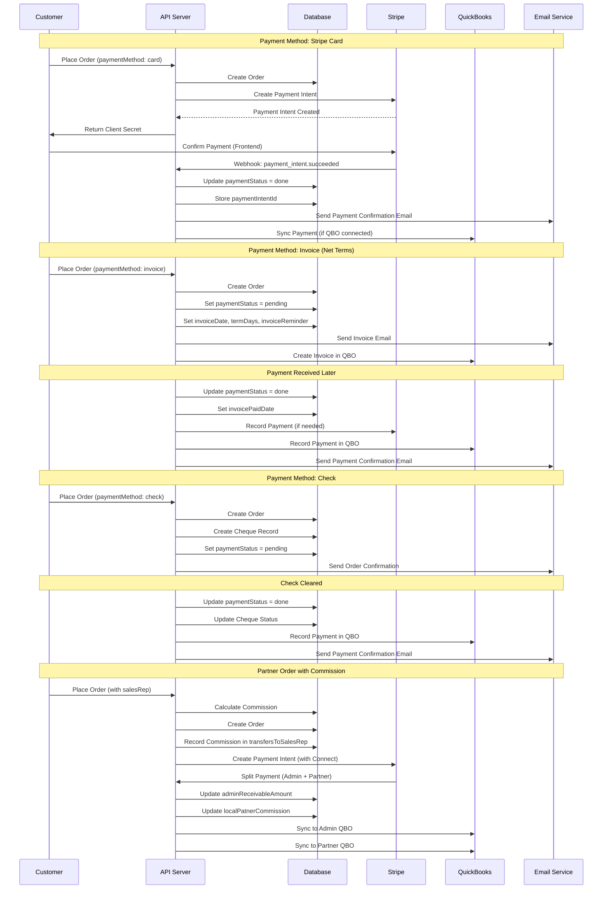

---

## 📋 Lead Management Flow

### Complete Lead Pipeline

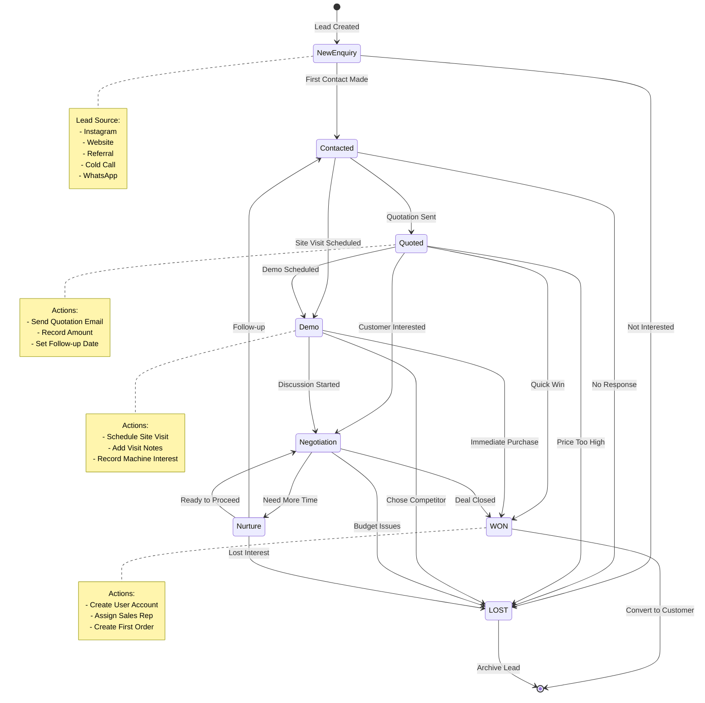

### Lead Assignment and Activity Flow

```mermaid
flowchart TD
    LeadCreated[New Lead Created] --> LogActivity1[Log: Lead Created]
    LogActivity1 --> Assign{Assign Lead?}

    Assign -->|To Sales Rep| AssignSR[Assign to Sales Rep]
    Assign -->|To Employee| AssignEmp[Assign to Employee]
    Assign -->|Unassigned| Unassigned[Keep Unassigned]

    AssignSR --> LogActivity2[Log: Assigned to Sales Rep]
    AssignEmp --> LogActivity3[Log: Assigned to Employee]

    LogActivity2 --> FollowUp{Follow-up Needed?}
    LogActivity3 --> FollowUp
    Unassigned --> FollowUp

    FollowUp -->|Yes| ScheduleFollowUp[Schedule Follow-up Date]
    ScheduleFollowUp --> LogActivity4[Log: Follow-up Scheduled]
    FollowUp -->|No| WaitAction[Wait for Action]

    WaitAction --> Action{Action Taken?}
    Action -->|Send Quotation| SendQuotation[Send Quotation]
    Action -->|Schedule Visit| ScheduleVisit[Schedule Site Visit]
    Action -->|Update Status| UpdateStatus[Update Lead Status]
    Action -->|Add Note| AddNote[Add Note/Feedback]

    SendQuotation --> LogActivity5[Log: Quotation Sent]
    LogActivity5 --> UpdateQuotation[Update: quotationSent = true]
    UpdateQuotation --> UpdateStatusLead[Update Status: Quoted]

    ScheduleVisit --> LogActivity6[Log: Site Visit Scheduled]
    LogActivity6 --> UpdateVisit[Update: siteVisitScheduled = true]
    UpdateVisit --> UpdateStatusVisit[Update Status: Demo/Scheduled]

    UpdateStatus --> LogActivity7[Log: Status Changed]
    AddNote --> LogActivity8[Log: Note Added]

    UpdateStatusLead --> WonLost{Won or Lost?}
    UpdateStatusVisit --> WonLost
    LogActivity7 --> WonLost
    LogActivity8 --> WonLost

    WonLost -->|WON| MarkWon[Mark as WON]
    WonLost -->|LOST| MarkLost[Mark as LOST]

    MarkWon --> LogActivity9[Log: Lead Won]
    LogActivity9 --> CreateCustomer[Create Customer Account]
    CreateCustomer --> ConvertComplete[Conversion Complete]

    MarkLost --> LogActivity10[Log: Lead Lost]
    LogActivity10 --> RecordReason[Record Lost Reason]
    RecordReason --> RecordFeedback[Record Customer Feedback]
    RecordFeedback --> ArchiveLead[Archive Lead]

    ConvertComplete --> [*]
    ArchiveLead --> [*]
```

---

## 📊 QuickBooks Online Integration Flow

### Complete QBO Sync Workflow

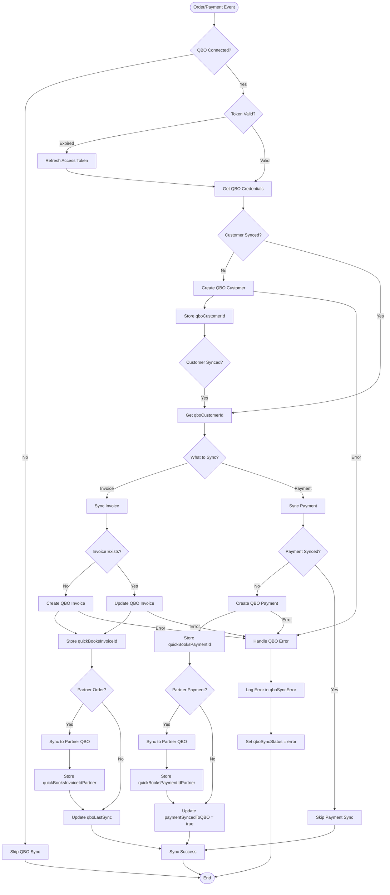

### Dual QBO Sync (Admin + Partner)

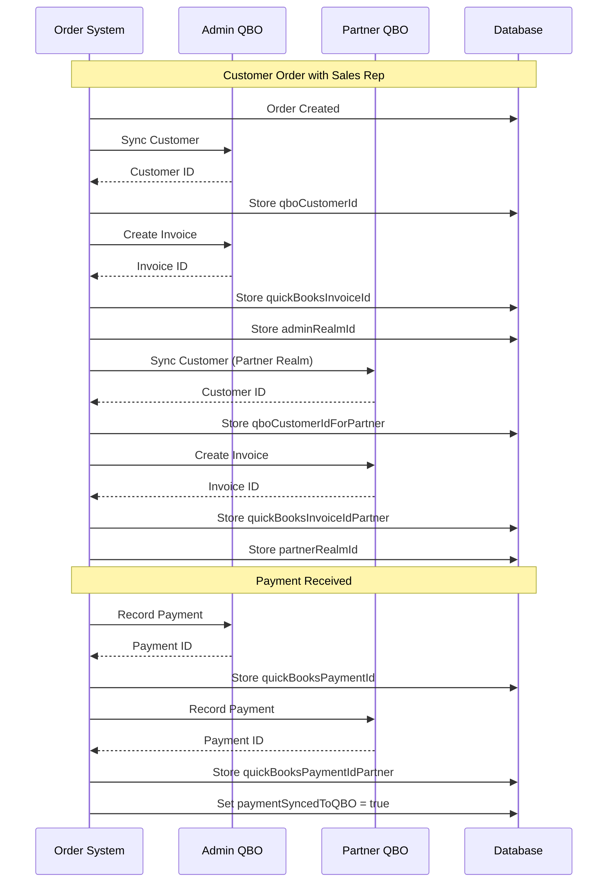

---

## 🔁 Recurring Order Automation Flow

### Automatic Order Creation

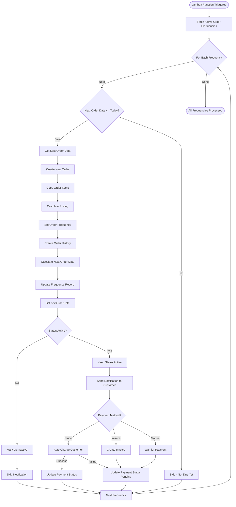

---

## 💰 Commission Calculation and Payout Flow

### Sales Rep Commission Processing

```mermaid
flowchart TD
    OrderPlaced[Order Placed] --> CheckSalesRep{Has Sales Rep?}
    CheckSalesRep -->|No| NoCommission[No Commission]
    CheckSalesRep -->|Yes| CheckPartnerType{Partner Type?}

    CheckPartnerType -->|Direct Partner| DirectCommission[Commission = Full Order Amount]
    CheckPartnerType -->|Dropship Partner| DropshipCommission[Commission = Price - Wholesale Price]

    DirectCommission --> CalculateTotal[Calculate Total Commission]
    DropshipCommission --> CalculateTotal

    CalculateTotal --> CalculateFees[Calculate Stripe Fees]
    CalculateFees --> ProportionalFee[Calculate Proportional Fee]
    ProportionalFee --> DeductFees[Deduct Fees from Commission]

    DeductFees --> NetCommission[Net Commission Amount]
    NetCommission --> RecordTransfer[Record in transfersToSalesRep]

    RecordTransfer --> StoreCommission[Store localPatnerCommission]
    StoreCommission --> CalculateAdmin[Calculate Admin Receivable]
    CalculateAdmin --> StoreAdmin[Store adminReceivableAmount]

    StoreAdmin --> CheckPayment{Payment Method?}

    CheckPayment -->|Stripe Card| StripePayout[Stripe Connect Payout]
    CheckPayment -->|Bank Account| BankPayout[Bank Account Pullout]
    CheckPayment -->|Invoice| InvoicePayout[Invoice - Defer Payout]

    StripePayout --> CreateTransfer[Create Stripe Transfer]
    CreateTransfer -->|Success| UpdatePaid[Update adminReceivableStatus = true]
    CreateTransfer -->|Failed| UpdatePending[Update adminReceivableStatus = false]

    BankPayout --> SchedulePullout[Schedule Pullout Date]
    SchedulePullout --> StorePulloutDate[Store pulloutDate]
    StorePulloutDate --> LambdaTrigger[Lambda Function Triggered]

    LambdaTrigger --> ProcessPullout[Process Bank Pullout]
    ProcessPullout --> CreatePulloutIntent[Create Pullout Intent]
    CreatePulloutIntent -->|Success| UpdatePaid
    CreatePulloutIntent -->|Failed| RetryPullout[Retry Later]

    InvoicePayout --> WaitPayment[Wait for Payment]
    WaitPayment --> PaymentReceived{Payment Received?}
    PaymentReceived -->|Yes| ProcessPayout[Process Payout]
    PaymentReceived -->|No| WaitReminder[Wait for Reminder]

    ProcessPayout --> UpdatePaid
    UpdatePaid --> SyncQBO[Sync to QuickBooks]
    SyncQBO --> SyncAdminQBO[Sync to Admin QBO]
    SyncAdminQBO --> SyncPartnerQBO[Sync to Partner QBO]

    SyncPartnerQBO --> CommissionComplete[Commission Paid]
    UpdatePending --> CommissionPending[Commission Pending]
    NoCommission --> NoCommissionEnd[No Commission]

    CommissionComplete --> [*]
    CommissionPending --> [*]
    NoCommissionEnd --> [*]
    RetryPullout --> [*]
    WaitReminder --> [*]
```

---

## 📱 Subscription Management Flow

### Coffee Machine Subscription Lifecycle

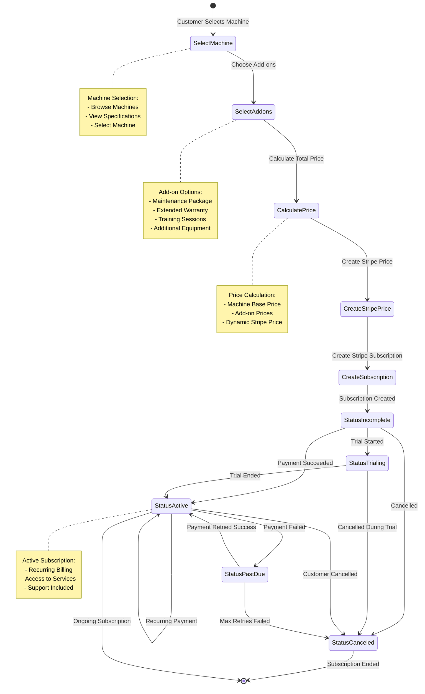

---

## 🔐 Authentication and Authorization Flow

### Complete Auth Flow with Redis

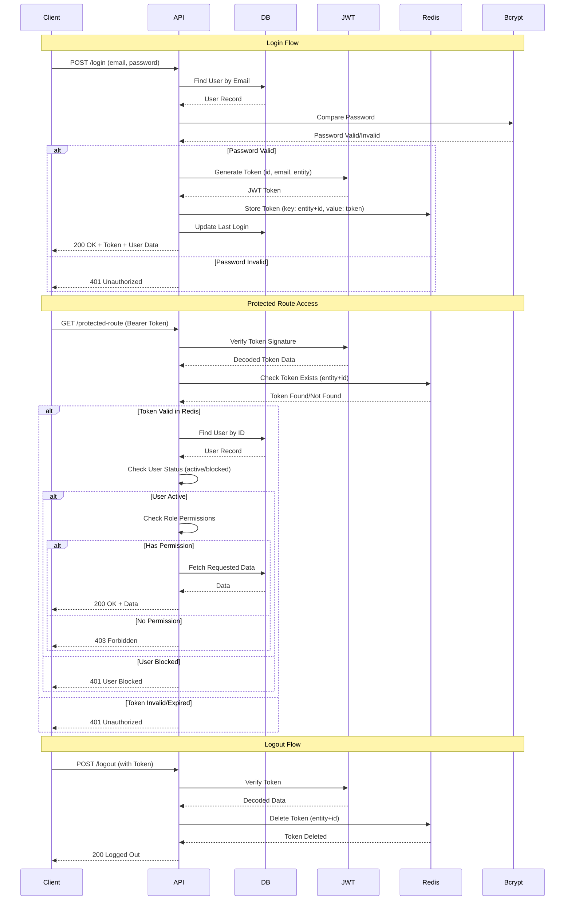

---

## 📧 Email Notification Flow

### Event-Driven Email System

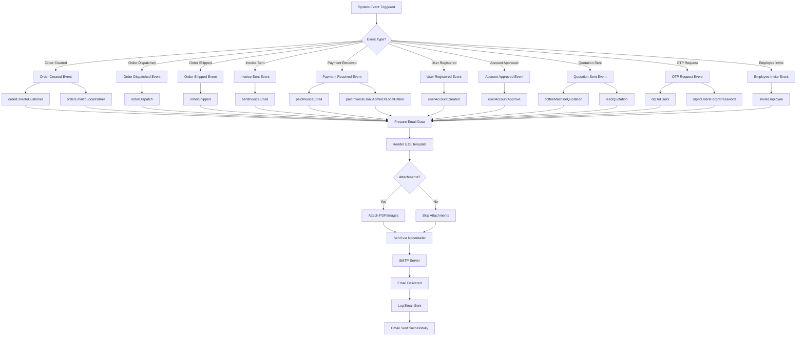

---

## 🏗️ System Architecture Flow

### Request Processing Pipeline

```mermaid
flowchart LR
    A[Client Request] --> B[Express Server]
    B --> C[Logging Middleware]
    C --> D[CORS Check]
    D --> E[Body Parser]
    E --> F[Helmet Security]
    F --> G[Rate Limiter]
    G --> H[Sanitize Input]
    H --> I{JWT Token?}

    I -->|Yes| J[Verify JWT]
    I -->|No| K[Public Route]

    J --> L[Check Redis Session]
    L --> M{Session Valid?}
    M -->|Yes| N[Load User Data]
    M -->|No| O[401 Unauthorized]

    N --> P[Role Check]
    P --> Q{Permission?}
    Q -->|Yes| R[Route Handler]
    Q -->|No| S[403 Forbidden]

    K --> R
    R --> T[Controller]
    T --> U[Service Layer]
    U --> V[Database Query]
    V --> W[Redis Cache Check]

    W --> X{Cached?}
    X -->|Yes| Y[Return Cached Data]
    X -->|No| Z[Query Database]

    Z --> AA[Process Data]
    AA --> AB[Cache Result]
    AB --> AC[Format Response]
    Y --> AC

    AC --> AD[Error Handler]
    AD --> AE[Response to Client]

    O --> AD
    S --> AD
```

---

## 📈 Data Flow Summary

### Complete System Data Flow

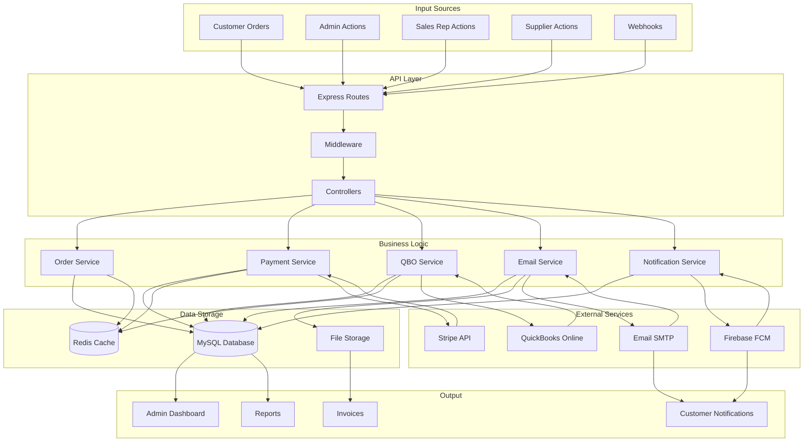

---

## 📝 Diagram Legend

### Relationship Types

- `||--o{` : One-to-Many (One entity has many related entities)
- `}o--||` : Many-to-One (Many entities belong to one entity)
- `||--||` : One-to-One
- `}o--o{` : Many-to-Many

### Flow Chart Symbols

- `[ ]` : Process/Step
- `{ }` : Decision Point
- `([ ])` : Start/End Point
- `-->` : Flow Direction

### Sequence Diagram

- `->>` : Synchronous call
- `-->>` : Response/Return
- `Note over` : Annotation

---

**End of ERD and Flow Diagrams**

_These diagrams provide a comprehensive visual representation of the Busy Beans backend system architecture, database relationships, and key business workflows._
