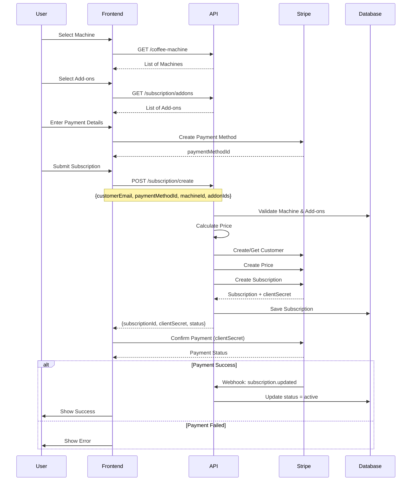

# Subscription API - Frontend Integration Guide

**Version:** 1.0.0  
**Last Updated:** December 11, 2025  
**Base URL:** `{{BASE_URL}}/api/v1/subscription`

---

## 📋 Table of Contents

1. [Overview](#overview)
2. [Authentication](#authentication)
3. [API Endpoints](#api-endpoints)
4. [Data Models](#data-models)
5. [Integration Flow](#integration-flow)
6. [Stripe Integration](#stripe-integration)
7. [UI Components Guide](#ui-components-guide)
8. [Error Handling](#error-handling)
9. [Code Examples](#code-examples)
10. [Testing](#testing)

---

## 🎯 Overview

The Subscription API allows customers to subscribe to coffee machines with optional add-ons. The system integrates with Stripe for payment processing and supports recurring monthly billing.

### Key Features

- ✅ Subscribe to coffee machines
- ✅ Add optional add-ons (maintenance, warranty, training, etc.)
- ✅ Automatic price calculation
- ✅ Stripe payment integration
- ✅ Recurring monthly billing
- ✅ Subscription management (view, cancel)
- ✅ Real-time status tracking

### Subscription Statuses

- `incomplete` - Subscription created but payment not completed
- `trialing` - In trial period
- `active` - Active subscription with successful payment
- `past_due` - Payment failed, retrying
- `canceled` - Subscription canceled (at period end)

---

## 🔐 Authentication

All subscription endpoints require authentication. Include the JWT token in the Authorization header:

```http
Authorization: Bearer <your_jwt_token>
```

**Note:** Some endpoints may be public (like listing machines and add-ons). Check individual endpoint documentation.

---

## 🛣️ API Endpoints

### Base URL

```
{{BASE_URL}}/api/v1/subscription
```

### 1. List Available Coffee Machines

Get all available coffee machines for subscription.

**Endpoint:** `GET /api/v1/users/coffee-machine`  
**Authentication:** Optional (Public endpoint)

**Request:**

```http
GET /api/v1/users/coffee-machine
```

**Response:**

```json
{
  "status": "success",
  "results": 5,
  "data": {
    "coffeeMachines": [
      {
        "id": 1,
        "name": "Commercial Espresso Machine Pro",
        "tag": "Premium",
        "type": "Espresso",
        "desc": "Professional-grade espresso machine...",
        "price": "299.99",
        "pricePer": "month",
        "uptoEmployees": 50,
        "image": "/public/machines/machine-1.jpg",
        "status": true,
        "deleted": false,
        "createdAt": "2025-01-15T10:00:00.000Z",
        "updatedAt": "2025-01-15T10:00:00.000Z"
      }
    ]
  }
}
```

**Fields:**

- `id` - Machine ID (use for subscription)
- `name` - Machine name
- `price` - Monthly subscription price
- `pricePer` - Billing period (week/month/year)
- `image` - Machine image URL
- `desc` - Machine description
- `uptoEmployees` - Maximum employees supported

---

### 2. Get Coffee Machine Details

Get details of a specific coffee machine.

**Endpoint:** `GET /api/v1/users/coffee-machine/:id`  
**Authentication:** Optional (Public endpoint)

**Request:**

```http
GET /api/v1/users/coffee-machine/1
```

**Response:**

```json
{
  "status": "success",
  "data": {
    "coffeeMachine": {
      "id": 1,
      "name": "Commercial Espresso Machine Pro",
      "tag": "Premium",
      "type": "Espresso",
      "desc": "Professional-grade espresso machine...",
      "price": "299.99",
      "pricePer": "month",
      "uptoEmployees": 50,
      "image": "/public/machines/machine-1.jpg",
      "status": true,
      "deleted": false
    }
  }
}
```

---

### 3. List Available Add-ons

Get all available subscription add-ons.

**Endpoint:** `GET /api/v1/subscription/addons`  
**Authentication:** Optional (Public endpoint)

**Request:**

```http
GET /api/v1/subscription/addons
```

**Response:**

```json
{
  "success": true,
  "count": 4,
  "addons": [
    {
      "id": 1,
      "name": "Premium Maintenance Package",
      "description": "Monthly maintenance and support",
      "price": "49.99",
      "status": true,
      "deleted": false,
      "createdAt": "2025-01-15T10:00:00.000Z",
      "updatedAt": "2025-01-15T10:00:00.000Z"
    },
    {
      "id": 2,
      "name": "Extended Warranty",
      "description": "Extended warranty coverage",
      "price": "29.99",
      "status": true,
      "deleted": false,
      "createdAt": "2025-01-15T10:00:00.000Z",
      "updatedAt": "2025-01-15T10:00:00.000Z"
    }
  ]
}
```

**Fields:**

- `id` - Add-on ID (use in subscription creation)
- `name` - Add-on name
- `description` - Add-on description
- `price` - Monthly add-on price
- `status` - Active status (true/false)

---

### 4. Create Subscription

Create a new subscription with a coffee machine and optional add-ons.

**Endpoint:** `POST /api/v1/subscription/create`  
**Authentication:** Required

**Request Body:**

```json
{
  "customerEmail": "customer@example.com",
  "paymentMethodId": "pm_1234567890abcdef",
  "machineId": 1,
  "addonIds": [1, 2]
}
```

**Request Fields:**

- `customerEmail` (required) - Customer email address
- `paymentMethodId` (required) - Stripe payment method ID (created via Stripe.js)
- `machineId` (required) - Coffee machine ID
- `addonIds` (optional) - Array of add-on IDs

**Response (Success - 201):**

```json
{
  "success": true,
  "subscriptionId": "550e8400-e29b-41d4-a716-446655440000",
  "stripeSubscriptionId": "sub_1234567890",
  "clientSecret": "pi_1234567890_secret_abcdef",
  "totalPrice": "379.97",
  "breakdown": {
    "machine": "299.99",
    "addons": "79.98",
    "addonDetails": [
      {
        "id": 1,
        "name": "Premium Maintenance Package",
        "price": 49.99
      },
      {
        "id": 2,
        "name": "Extended Warranty",
        "price": 29.99
      }
    ]
  },
  "status": "incomplete"
}
```

**Response Fields:**

- `subscriptionId` - Internal subscription UUID
- `stripeSubscriptionId` - Stripe subscription ID
- `clientSecret` - Stripe payment intent client secret (for 3D Secure)
- `totalPrice` - Total monthly subscription price
- `breakdown` - Price breakdown (machine + addons)
- `status` - Initial subscription status

**Error Responses:**

**400 Bad Request:**

```json
{
  "success": false,
  "error": "customerEmail, paymentMethodId, and machineId are required"
}
```

**404 Not Found:**

```json
{
  "success": false,
  "error": "Machine not found"
}
```

**400 Bad Request (Invalid Add-ons):**

```json
{
  "success": false,
  "error": "One or more add-ons not found or inactive"
}
```

**500 Internal Server Error:**

```json
{
  "success": false,
  "error": "Failed to create subscription"
}
```

---

### 5. Get Subscription Details

Get details of a specific subscription.

**Endpoint:** `GET /api/v1/subscription/:id`  
**Authentication:** Required

**Request:**

```http
GET /api/v1/subscription/550e8400-e29b-41d4-a716-446655440000
```

**Response (Success - 200):**

```json
{
  "success": true,
  "subscription": {
    "id": "550e8400-e29b-41d4-a716-446655440000",
    "customerEmail": "customer@example.com",
    "stripeCustomerId": "cus_1234567890",
    "stripeSubscriptionId": "sub_1234567890",
    "stripePriceId": "price_1234567890",
    "totalPrice": "379.97",
    "status": "active",
    "machineId": 1,
    "currentPeriodStart": "2025-12-01T00:00:00.000Z",
    "currentPeriodEnd": "2026-01-01T00:00:00.000Z",
    "canceledAt": null,
    "createdAt": "2025-12-01T10:00:00.000Z",
    "updatedAt": "2025-12-01T10:00:00.000Z",
    "machine": {
      "id": 1,
      "name": "Commercial Espresso Machine Pro",
      "price": "299.99",
      "image": "/public/machines/machine-1.jpg"
    },
    "addons": [
      {
        "id": 1,
        "name": "Premium Maintenance Package",
        "description": "Monthly maintenance and support",
        "price": "49.99"
      },
      {
        "id": 2,
        "name": "Extended Warranty",
        "description": "Extended warranty coverage",
        "price": "29.99"
      }
    ]
  }
}
```

**Error Response (404):**

```json
{
  "success": false,
  "error": "Subscription not found"
}
```

---

### 6. List Subscriptions

Get a list of subscriptions with optional filtering.

**Endpoint:** `GET /api/v1/subscription/list`  
**Authentication:** Required

**Query Parameters:**

- `customerEmail` (optional) - Filter by customer email
- `status` (optional) - Filter by status (active, canceled, past_due, incomplete, trialing)

**Request Examples:**

```http
GET /api/v1/subscription/list
GET /api/v1/subscription/list?customerEmail=customer@example.com
GET /api/v1/subscription/list?status=active
GET /api/v1/subscription/list?customerEmail=customer@example.com&status=active
```

**Response (Success - 200):**

```json
{
  "success": true,
  "count": 2,
  "subscriptions": [
    {
      "id": "550e8400-e29b-41d4-a716-446655440000",
      "customerEmail": "customer@example.com",
      "totalPrice": "379.97",
      "status": "active",
      "currentPeriodStart": "2025-12-01T00:00:00.000Z",
      "currentPeriodEnd": "2026-01-01T00:00:00.000Z",
      "machine": {
        "id": 1,
        "name": "Commercial Espresso Machine Pro",
        "price": "299.99"
      },
      "addons": [
        {
          "id": 1,
          "name": "Premium Maintenance Package",
          "price": "49.99"
        }
      ]
    }
  ]
}
```

---

### 7. Cancel Subscription

Cancel a subscription (cancels at period end).

**Endpoint:** `POST /api/v1/subscription/:id/cancel`  
**Authentication:** Required

**Request:**

```http
POST /api/v1/subscription/550e8400-e29b-41d4-a716-446655440000/cancel
```

**Response (Success - 200):**

```json
{
  "success": true,
  "message": "Subscription will be canceled at period end",
  "subscription": {
    "id": "550e8400-e29b-41d4-a716-446655440000",
    "status": "canceled",
    "canceledAt": "2025-12-11T10:00:00.000Z"
  },
  "periodEnd": "2026-01-01T00:00:00.000Z"
}
```

**Error Response (404):**

```json
{
  "success": false,
  "error": "Subscription not found"
}
```

---

## 📊 Data Models

### Subscription Model

```typescript
interface Subscription {
  id: string; // UUID
  customerEmail: string;
  stripeCustomerId: string | null;
  stripeSubscriptionId: string | null;
  stripePriceId: string | null;
  totalPrice: number; // Decimal(15, 2)
  status: "active" | "canceled" | "past_due" | "incomplete" | "trialing";
  machineId: number;
  currentPeriodStart: Date | null;
  currentPeriodEnd: Date | null;
  canceledAt: Date | null;
  createdAt: Date;
  updatedAt: Date;
  machine?: CoffeeMachine;
  addons?: Addon[];
}
```

### Coffee Machine Model

```typescript
interface CoffeeMachine {
  id: number;
  name: string;
  tag: string;
  type: string;
  desc: string;
  price: number; // Decimal(15, 2)
  pricePer: "week" | "month" | "year";
  uptoEmployees: number;
  image: string | null;
  status: boolean;
  deleted: boolean;
  createdAt: Date;
  updatedAt: Date;
}
```

### Addon Model

```typescript
interface Addon {
  id: number;
  name: string;
  description: string | null;
  price: number; // Decimal(15, 2)
  status: boolean;
  deleted: boolean;
  createdAt: Date;
  updatedAt: Date;
}
```

### Price Breakdown

```typescript
interface PriceBreakdown {
  total: number;
  breakdown: {
    machine: number;
    addons: number;
    addonDetails: Array<{
      id: number;
      name: string;
      price: number;
    }>;
  };
}
```

---

## 🔄 Integration Flow

### Complete Subscription Creation Flow



### Step-by-Step Integration

1. **Load Machines and Add-ons**

   - Fetch available machines: `GET /coffee-machine`
   - Fetch available add-ons: `GET /subscription/addons`
   - Display in UI for selection

2. **User Selection**

   - User selects a machine
   - User selects optional add-ons
   - Calculate and display total price (frontend calculation for preview)

3. **Payment Method Setup**

   - Use Stripe.js to collect payment details
   - Create payment method: `stripe.createPaymentMethod()`
   - Get `paymentMethodId`

4. **Create Subscription**

   - Call `POST /subscription/create` with:
     - `customerEmail`
     - `paymentMethodId`
     - `machineId`
     - `addonIds` (array)
   - Receive `clientSecret` in response

5. **Confirm Payment**

   - Use Stripe.js to confirm payment with `clientSecret`
   - Handle 3D Secure if required
   - Wait for payment confirmation

6. **Handle Webhook (Backend)**
   - Backend receives Stripe webhook
   - Updates subscription status
   - Frontend can poll or use WebSocket for status updates

---

## 💳 Stripe Integration

### Required Stripe.js Setup

```html
<script src="https://js.stripe.com/v3/"></script>
```

```javascript
const stripe = Stripe("pk_test_your_publishable_key");
```

### Creating Payment Method

```javascript
// Create payment method from card element
const { paymentMethod, error } = await stripe.createPaymentMethod({
  type: "card",
  card: cardElement, // Stripe Elements card element
  billing_details: {
    email: customerEmail,
  },
});

if (error) {
  console.error("Error creating payment method:", error);
  return;
}

const paymentMethodId = paymentMethod.id;
```

### Confirming Payment

```javascript
// After receiving clientSecret from API
const { error, paymentIntent } = await stripe.confirmCardPayment(clientSecret, {
  payment_method: paymentMethodId,
});

if (error) {
  // Handle error (e.g., card declined)
  console.error("Payment failed:", error);
} else if (paymentIntent.status === "succeeded") {
  // Payment successful
  console.log("Payment succeeded!");
}
```

### Handling 3D Secure

Stripe automatically handles 3D Secure authentication. The `confirmCardPayment` method will show the authentication modal if required.

---

## 🎨 UI Components Guide

### 1. Machine Selection Component

**Features:**

- Display machine cards with image, name, price
- Show machine details (description, employee capacity)
- Highlight selected machine
- Display monthly/yearly price

**UI Elements:**

```jsx
<MachineCard
  machine={machine}
  selected={selectedMachineId === machine.id}
  onSelect={handleMachineSelect}
/>
```

**Data to Display:**

- Machine image
- Machine name
- Monthly price
- Description
- Employee capacity
- Machine type/tag

---

### 2. Add-on Selection Component

**Features:**

- Display available add-ons as checkboxes/cards
- Show add-on price
- Calculate running total
- Allow multiple selections

**UI Elements:**

```jsx
<AddonCard
  addon={addon}
  selected={selectedAddonIds.includes(addon.id)}
  onToggle={handleAddonToggle}
/>
```

**Data to Display:**

- Add-on name
- Description
- Monthly price
- Checkbox/toggle

---

### 3. Price Summary Component

**Features:**

- Show machine price
- List selected add-ons with prices
- Display total monthly price
- Show billing period

**UI Elements:**

```jsx
<PriceSummary
  machine={selectedMachine}
  addons={selectedAddons}
  total={calculatedTotal}
/>
```

**Display Format:**

```
Machine:              $299.99/month
Premium Maintenance:  $49.99/month
Extended Warranty:    $29.99/month
─────────────────────────────
Total:               $379.97/month
```

---

### 4. Payment Form Component

**Features:**

- Stripe Elements card input
- Email input
- Submit button
- Loading state
- Error display

**UI Elements:**

```jsx
<PaymentForm
  email={customerEmail}
  onEmailChange={handleEmailChange}
  onSubmit={handleSubmit}
  loading={isSubmitting}
  error={error}
/>
```

**Stripe Elements:**

```javascript
const cardElement = elements.getElement("card");
```

---

### 5. Subscription Status Component

**Features:**

- Display subscription status badge
- Show current period dates
- Display next billing date
- Show cancel button (if active)

**Status Badges:**

- 🟢 Active (green)
- 🟡 Trialing (yellow)
- 🔴 Past Due (red)
- ⚪ Canceled (gray)
- ⚪ Incomplete (gray)

**UI Elements:**

```jsx
<SubscriptionStatus subscription={subscription} onCancel={handleCancel} />
```

---

### 6. Subscription List Component

**Features:**

- List all user subscriptions
- Filter by status
- Show machine and add-ons
- Link to subscription details
- Cancel action

**UI Elements:**

```jsx
<SubscriptionList
  subscriptions={subscriptions}
  onViewDetails={handleViewDetails}
  onCancel={handleCancel}
/>
```

---

## ⚠️ Error Handling

### Common Error Scenarios

#### 1. Invalid Machine ID

```json
{
  "success": false,
  "error": "Machine not found"
}
```

**UI Response:** Show error message, allow user to select different machine.

#### 2. Invalid Add-on IDs

```json
{
  "success": false,
  "error": "One or more add-ons not found or inactive"
}
```

**UI Response:** Refresh add-ons list, remove invalid selections.

#### 3. Payment Method Creation Failed

```javascript
// Stripe error
{
  type: 'card_error',
  code: 'card_declined',
  message: 'Your card was declined.'
}
```

**UI Response:** Show error message, allow user to try different card.

#### 4. Payment Confirmation Failed

```javascript
// Stripe error
{
  type: 'card_error',
  code: 'authentication_required',
  message: 'Your card was declined.'
}
```

**UI Response:** Show 3D Secure modal, retry authentication.

#### 5. Network Errors

**UI Response:** Show retry button, maintain form state.

### Error Handling Best Practices

1. **Always validate on frontend first**

   - Check required fields
   - Validate email format
   - Ensure machine/add-ons selected

2. **Display user-friendly error messages**

   - Don't show technical errors
   - Provide actionable guidance
   - Use icons/colors for error states

3. **Handle loading states**

   - Show loading spinner during API calls
   - Disable submit button during processing
   - Prevent duplicate submissions

4. **Retry logic**
   - For network errors, allow retry
   - For payment errors, allow card update
   - For server errors, show support contact

---

## 💻 Code Examples

### React Example - Complete Subscription Flow

```jsx
import React, { useState, useEffect } from "react";
import { loadStripe } from "@stripe/stripe-js";
import {
  Elements,
  CardElement,
  useStripe,
  useElements,
} from "@stripe/react-stripe-js";

const stripePromise = loadStripe("pk_test_your_publishable_key");

function SubscriptionForm() {
  const [machines, setMachines] = useState([]);
  const [addons, setAddons] = useState([]);
  const [selectedMachine, setSelectedMachine] = useState(null);
  const [selectedAddons, setSelectedAddons] = useState([]);
  const [email, setEmail] = useState("");
  const [loading, setLoading] = useState(false);
  const [error, setError] = useState(null);

  // Load machines and add-ons
  useEffect(() => {
    fetchMachines();
    fetchAddons();
  }, []);

  const fetchMachines = async () => {
    try {
      const response = await fetch("/api/v1/users/coffee-machine");
      const data = await response.json();
      setMachines(data.data.coffeeMachines);
    } catch (err) {
      console.error("Error fetching machines:", err);
    }
  };

  const fetchAddons = async () => {
    try {
      const response = await fetch("/api/v1/subscription/addons");
      const data = await response.json();
      setAddons(data.addons);
    } catch (err) {
      console.error("Error fetching add-ons:", err);
    }
  };

  const handleSubmit = async (e) => {
    e.preventDefault();
    setLoading(true);
    setError(null);

    try {
      const stripe = await stripePromise;
      const elements = stripe.elements();
      const cardElement = elements.getElement("card");

      // Create payment method
      const { paymentMethod, error: pmError } =
        await stripe.createPaymentMethod({
          type: "card",
          card: cardElement,
          billing_details: { email },
        });

      if (pmError) {
        setError(pmError.message);
        setLoading(false);
        return;
      }

      // Create subscription
      const response = await fetch("/api/v1/subscription/create", {
        method: "POST",
        headers: {
          "Content-Type": "application/json",
          Authorization: `Bearer ${getAuthToken()}`,
        },
        body: JSON.stringify({
          customerEmail: email,
          paymentMethodId: paymentMethod.id,
          machineId: selectedMachine.id,
          addonIds: selectedAddons.map((a) => a.id),
        }),
      });

      const data = await response.json();

      if (!data.success) {
        setError(data.error);
        setLoading(false);
        return;
      }

      // Confirm payment
      const { error: confirmError } = await stripe.confirmCardPayment(
        data.clientSecret,
        {
          payment_method: paymentMethod.id,
        }
      );

      if (confirmError) {
        setError(confirmError.message);
      } else {
        // Success! Redirect or show success message
        window.location.href = `/subscription/${data.subscriptionId}`;
      }
    } catch (err) {
      setError("An unexpected error occurred");
      console.error(err);
    } finally {
      setLoading(false);
    }
  };

  const calculateTotal = () => {
    const machinePrice = selectedMachine
      ? parseFloat(selectedMachine.price)
      : 0;
    const addonTotal = selectedAddons.reduce((sum, addon) => {
      return sum + parseFloat(addon.price);
    }, 0);
    return (machinePrice + addonTotal).toFixed(2);
  };

  return (
    <Elements stripe={stripePromise}>
      <form onSubmit={handleSubmit}>
        <h2>Select Machine</h2>
        {machines.map((machine) => (
          <div key={machine.id}>
            <input
              type="radio"
              id={`machine-${machine.id}`}
              checked={selectedMachine?.id === machine.id}
              onChange={() => setSelectedMachine(machine)}
            />
            <label htmlFor={`machine-${machine.id}`}>
              {machine.name} - ${machine.price}/month
            </label>
          </div>
        ))}

        <h2>Select Add-ons</h2>
        {addons.map((addon) => (
          <div key={addon.id}>
            <input
              type="checkbox"
              id={`addon-${addon.id}`}
              checked={selectedAddons.some((a) => a.id === addon.id)}
              onChange={(e) => {
                if (e.target.checked) {
                  setSelectedAddons([...selectedAddons, addon]);
                } else {
                  setSelectedAddons(
                    selectedAddons.filter((a) => a.id !== addon.id)
                  );
                }
              }}
            />
            <label htmlFor={`addon-${addon.id}`}>
              {addon.name} - ${addon.price}/month
            </label>
          </div>
        ))}

        <div>
          <h3>Total: ${calculateTotal()}/month</h3>
        </div>

        <div>
          <label>Email</label>
          <input
            type="email"
            value={email}
            onChange={(e) => setEmail(e.target.value)}
            required
          />
        </div>

        <div>
          <label>Card Details</label>
          <CardElement />
        </div>

        {error && <div className="error">{error}</div>}

        <button type="submit" disabled={loading || !selectedMachine}>
          {loading ? "Processing..." : "Subscribe"}
        </button>
      </form>
    </Elements>
  );
}

export default SubscriptionForm;
```

### Vue.js Example - Subscription List

```vue
<template>
  <div class="subscription-list">
    <h2>My Subscriptions</h2>

    <div v-if="loading">Loading...</div>
    <div v-else-if="error" class="error">{{ error }}</div>
    <div v-else>
      <div
        v-for="subscription in subscriptions"
        :key="subscription.id"
        class="subscription-card"
      >
        <h3>{{ subscription.machine.name }}</h3>
        <p>
          Status:
          <span :class="subscription.status">{{ subscription.status }}</span>
        </p>
        <p>Total: ${{ subscription.totalPrice }}/month</p>
        <p>
          Period: {{ formatDate(subscription.currentPeriodStart) }} -
          {{ formatDate(subscription.currentPeriodEnd) }}
        </p>

        <div v-if="subscription.addons.length > 0">
          <h4>Add-ons:</h4>
          <ul>
            <li v-for="addon in subscription.addons" :key="addon.id">
              {{ addon.name }} - ${{ addon.price }}/month
            </li>
          </ul>
        </div>

        <button
          v-if="subscription.status === 'active'"
          @click="cancelSubscription(subscription.id)"
          :disabled="canceling"
        >
          Cancel Subscription
        </button>
      </div>
    </div>
  </div>
</template>

<script>
export default {
  data() {
    return {
      subscriptions: [],
      loading: true,
      error: null,
      canceling: false,
    };
  },
  mounted() {
    this.fetchSubscriptions();
  },
  methods: {
    async fetchSubscriptions() {
      try {
        const response = await fetch("/api/v1/subscription/list", {
          headers: {
            Authorization: `Bearer ${this.getAuthToken()}`,
          },
        });
        const data = await response.json();
        if (data.success) {
          this.subscriptions = data.subscriptions;
        } else {
          this.error = data.error;
        }
      } catch (err) {
        this.error = "Failed to load subscriptions";
      } finally {
        this.loading = false;
      }
    },
    async cancelSubscription(id) {
      if (!confirm("Are you sure you want to cancel this subscription?")) {
        return;
      }

      this.canceling = true;
      try {
        const response = await fetch(`/api/v1/subscription/${id}/cancel`, {
          method: "POST",
          headers: {
            Authorization: `Bearer ${this.getAuthToken()}`,
          },
        });
        const data = await response.json();
        if (data.success) {
          await this.fetchSubscriptions(); // Refresh list
          alert("Subscription will be canceled at period end");
        } else {
          alert(data.error);
        }
      } catch (err) {
        alert("Failed to cancel subscription");
      } finally {
        this.canceling = false;
      }
    },
    formatDate(dateString) {
      return new Date(dateString).toLocaleDateString();
    },
    getAuthToken() {
      return localStorage.getItem("authToken");
    },
  },
};
</script>
```

### Vanilla JavaScript Example - API Client

```javascript
class SubscriptionAPI {
  constructor(baseURL, authToken) {
    this.baseURL = baseURL;
    this.authToken = authToken;
  }

  async request(endpoint, options = {}) {
    const url = `${this.baseURL}${endpoint}`;
    const headers = {
      "Content-Type": "application/json",
      ...options.headers,
    };

    if (this.authToken) {
      headers["Authorization"] = `Bearer ${this.authToken}`;
    }

    const response = await fetch(url, {
      ...options,
      headers,
    });

    const data = await response.json();

    if (!response.ok) {
      throw new Error(data.error || "Request failed");
    }

    return data;
  }

  async getMachines() {
    return this.request("/api/v1/users/coffee-machine");
  }

  async getMachine(id) {
    return this.request(`/api/v1/users/coffee-machine/${id}`);
  }

  async getAddons() {
    return this.request("/api/v1/subscription/addons");
  }

  async createSubscription(subscriptionData) {
    return this.request("/api/v1/subscription/create", {
      method: "POST",
      body: JSON.stringify(subscriptionData),
    });
  }

  async getSubscription(id) {
    return this.request(`/api/v1/subscription/${id}`);
  }

  async listSubscriptions(filters = {}) {
    const queryParams = new URLSearchParams(filters).toString();
    const endpoint = `/api/v1/subscription/list${queryParams ? `?${queryParams}` : ""}`;
    return this.request(endpoint);
  }

  async cancelSubscription(id) {
    return this.request(`/api/v1/subscription/${id}/cancel`, {
      method: "POST",
    });
  }
}

// Usage
const api = new SubscriptionAPI("https://api.busybeans.com", "your-jwt-token");

// Get machines
const machinesData = await api.getMachines();
console.log(machinesData.data.coffeeMachines);

// Create subscription
const subscription = await api.createSubscription({
  customerEmail: "customer@example.com",
  paymentMethodId: "pm_1234567890",
  machineId: 1,
  addonIds: [1, 2],
});
console.log(subscription);
```

---

## 🧪 Testing

### Test Data

**Test Machines:**

- Machine ID: 1 (Commercial Espresso Machine Pro)
- Machine ID: 2 (Compact Office Machine)

**Test Add-ons:**

- Add-on ID: 1 (Premium Maintenance Package)
- Add-on ID: 2 (Extended Warranty)
- Add-on ID: 3 (Training Sessions)

**Test Stripe Cards:**

- Success: `4242 4242 4242 4242`
- Decline: `4000 0000 0000 0002`
- 3D Secure: `4000 0027 6000 3184`

### Testing Checklist

- [ ] Load machines list
- [ ] Load add-ons list
- [ ] Select machine
- [ ] Select add-ons
- [ ] Calculate total price
- [ ] Create payment method
- [ ] Create subscription
- [ ] Confirm payment (success)
- [ ] Confirm payment (declined)
- [ ] Handle 3D Secure
- [ ] Get subscription details
- [ ] List subscriptions
- [ ] Filter subscriptions by status
- [ ] Cancel subscription
- [ ] Handle errors gracefully

---

## 📝 Notes

### Important Considerations

1. **Payment Method ID**

   - Must be created via Stripe.js before calling create subscription
   - Payment method is attached to Stripe customer automatically

2. **Client Secret**

   - Used to confirm payment on frontend
   - Required for 3D Secure authentication
   - Store securely, don't expose in logs

3. **Subscription Status**

   - Status updates via Stripe webhooks (backend handles)
   - Frontend can poll subscription endpoint for status updates
   - Consider WebSocket for real-time updates

4. **Price Calculation**

   - Backend calculates total price
   - Frontend can calculate for preview, but use backend value for final

5. **Cancellation**

   - Cancellation is at period end (not immediate)
   - Customer has access until period end
   - Status changes to "canceled" immediately, but service continues

6. **Recurring Billing**
   - Automatic monthly billing via Stripe
   - No action required from frontend
   - Backend handles webhooks for payment success/failure

---

## 🔗 Related Endpoints

### Coffee Machine Endpoints (Public)

- `GET /api/v1/users/coffee-machine` - List all machines
- `GET /api/v1/users/coffee-machine/:id` - Get machine details

### Admin Endpoints (Protected)

- `GET /api/v1/admin/coffee-machine` - Admin: List machines
- `POST /api/v1/admin/coffee-machine` - Admin: Create machine
- `PATCH /api/v1/admin/coffee-machine/:id` - Admin: Update machine
- `DELETE /api/v1/admin/coffee-machine/:id` - Admin: Delete machine

---

## 📞 Support

For API support or questions:

- Email: support@busybeans.com
- Documentation: https://docs.busybeans.com
- Status Page: https://status.busybeans.com

---

**End of Documentation**

_This guide provides everything needed to integrate the Subscription API into your frontend application. For additional help, refer to the main API documentation or contact support._
