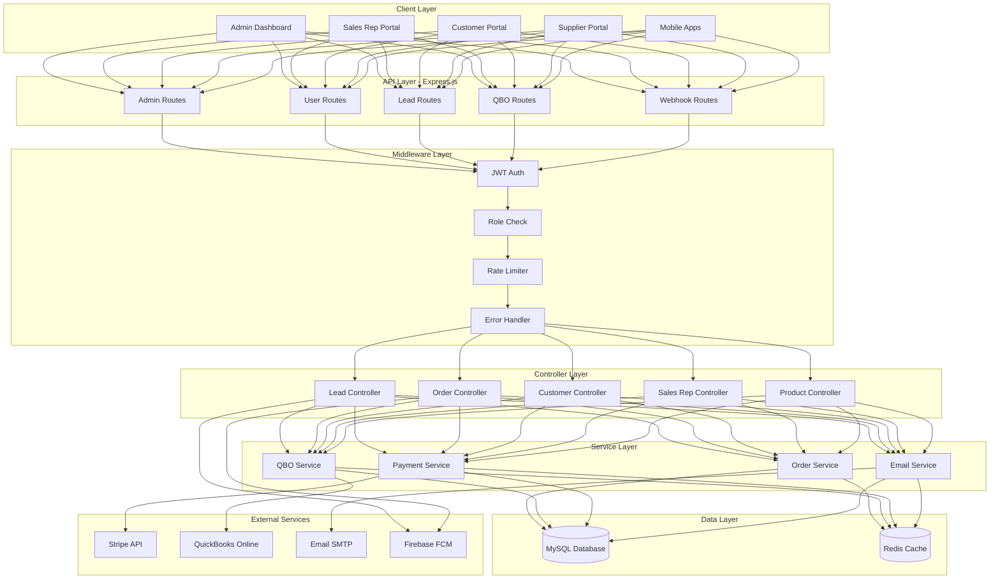
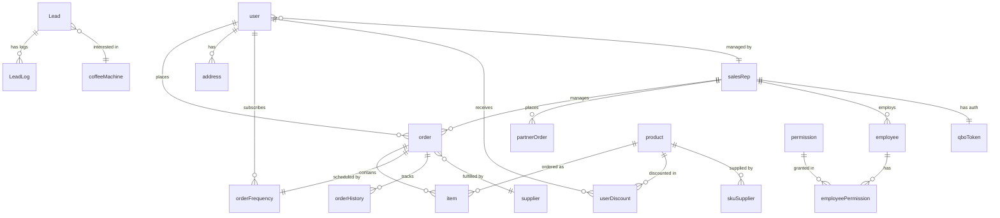
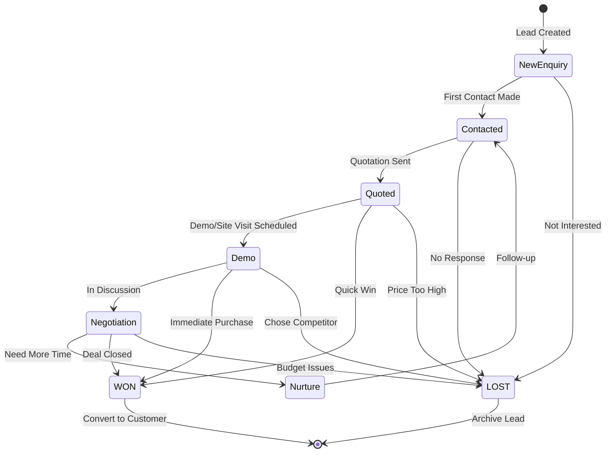
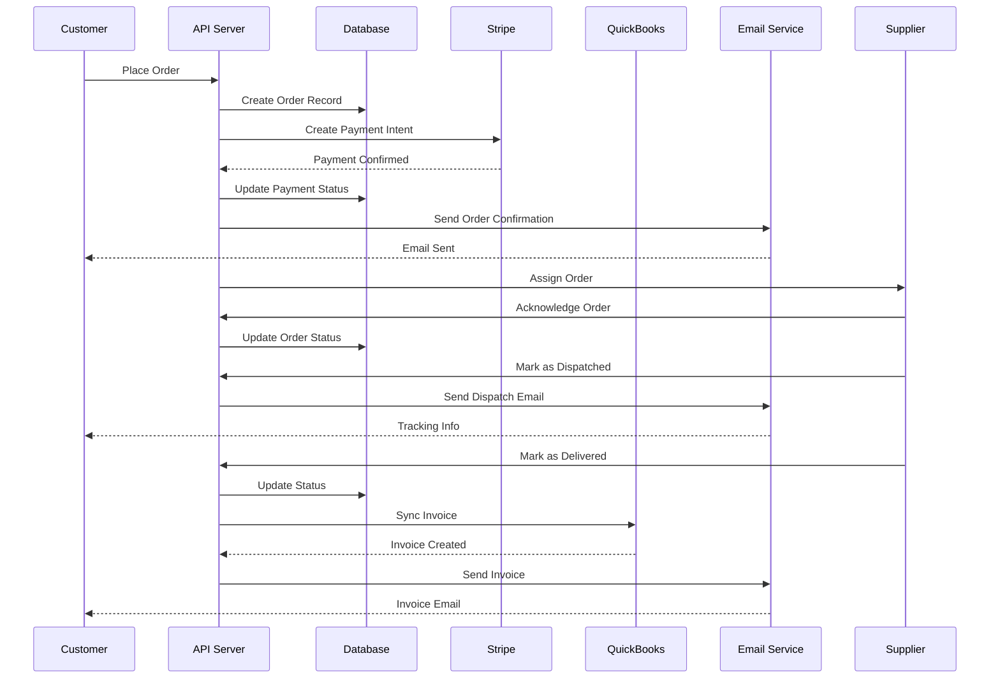
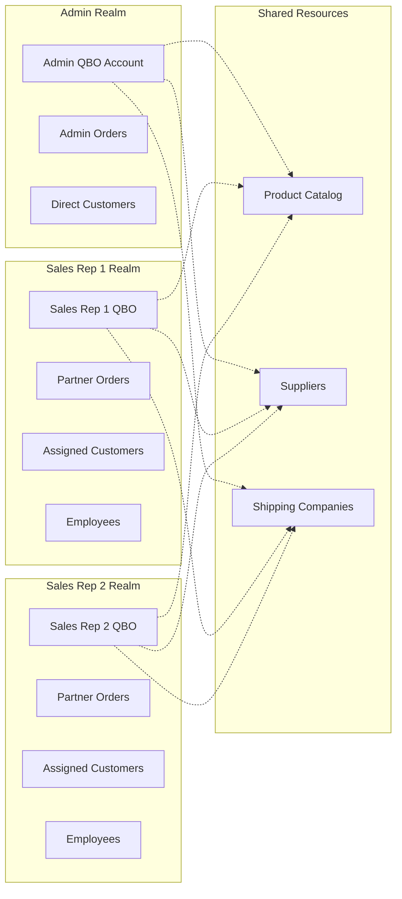
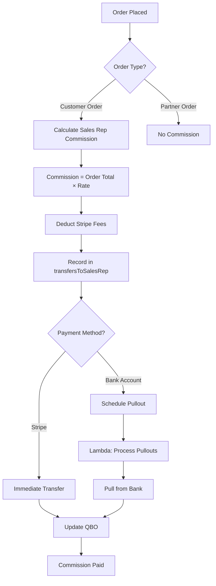
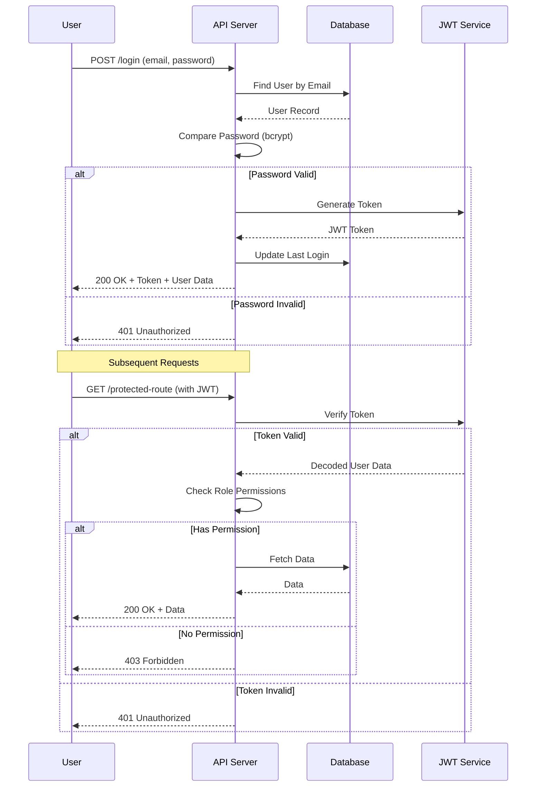
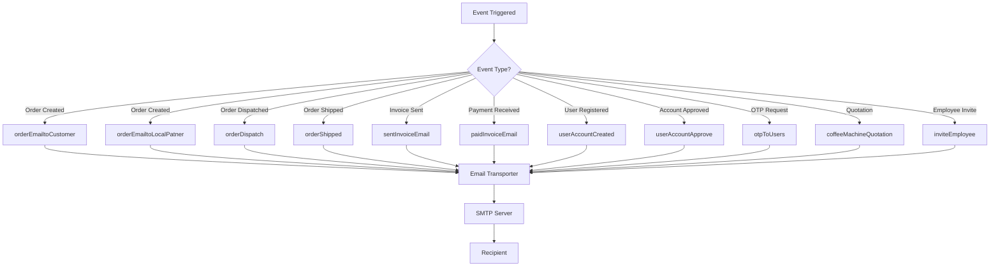
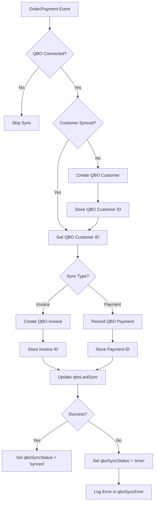
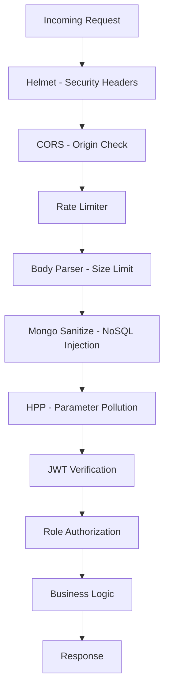

# Busy Beans Backend - Architecture Diagrams

## System Architecture

## Database Entity Relationships

## Lead Management Pipeline

## Order Processing Flow

## Multi-Tenant Architecture

## Commission Calculation Flow

## Authentication & Authorization Flow

## Email Notification System

## QuickBooks Sync Process

---

## Key Design Patterns

### 1. **Factory Pattern**
- `handlerFactory.js` - Generic CRUD operations

### 2. **Middleware Chain**
- Authentication → Authorization → Rate Limiting → Business Logic

### 3. **Event-Driven**
- Order events trigger emails, notifications, QBO sync

### 4. **Repository Pattern**
- Sequelize models abstract database operations

### 5. **Service Layer**
- Business logic separated from controllers

---

## Security Layers

---

This architecture provides a scalable, secure, and maintainable foundation for the Busy Beans Coffee distribution platform! 🏗️☕
