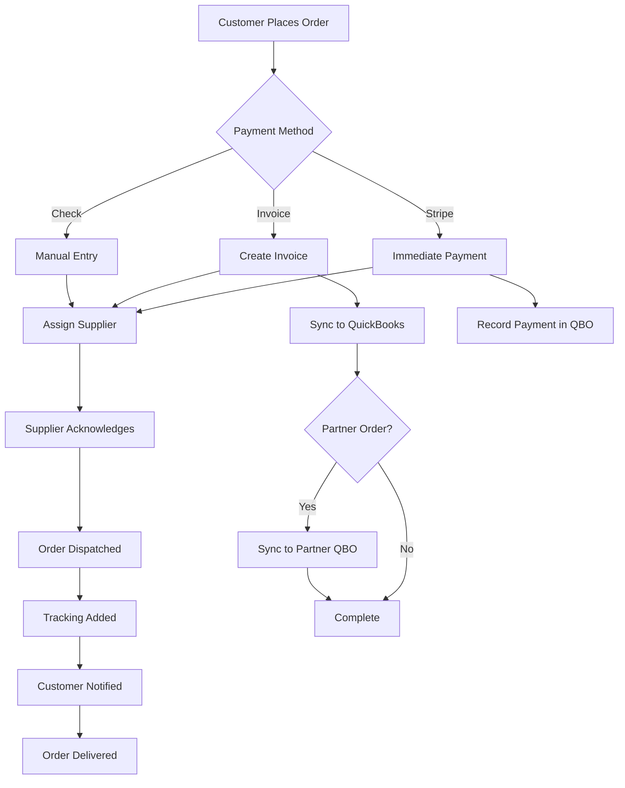
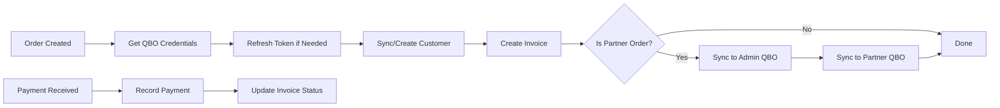
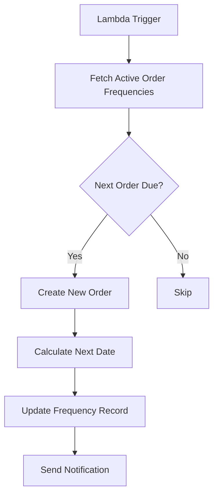

# Busy Beans Backend - Complete Project Documentation

## 📋 Executive Summary

**Busy Beans Backend** is a comprehensive Node.js/Express API for managing a coffee distribution business. The system handles customer orders, partner/local distributor workflows, inventory management, QuickBooks accounting integration, Stripe payment processing, subscription management, and lead tracking.

---

## 🏗️ Architecture Overview

### Technology Stack

**Core Framework:**
- **Runtime**: Node.js (>=10.0.0)
- **Framework**: Express.js
- **Database**: MySQL with Sequelize ORM
- **Caching**: Redis (via ioredis)

**Key Integrations:**
- **Payment Processing**: Stripe (customer payments, partner payouts, subscriptions)
- **Accounting**: QuickBooks Online API (invoice sync, payment tracking)
- **Email**: Nodemailer (transactional emails, quotations, invoices)
- **Notifications**: Firebase Admin (push notifications)
- **File Storage**: Local file system with Sharp for image processing
- **PDF Generation**: Puppeteer

**Security & Performance:**
- JWT authentication with Redis session management
- bcryptjs for password hashing
- Helmet, CORS, express-rate-limit for API security
- Compression middleware

---

## 📁 Project Structure

```
busy-beans-backend/
├── app.js                    # Express app configuration
├── bb.js                     # Server entry point
├── models/                   # Sequelize models (41 files)
├── controllers/              # Business logic
│   ├── admin/               # Admin-specific controllers (22 files)
│   ├── customer/            # Customer controllers (4 files)
│   ├── events/              # Event handlers (9 files)
│   └── webhook/             # Webhook handlers
├── routes/                   # API routes (7 files)
├── services/                 # Business services (12 files)
├── middlewares/              # Auth & validation (3 files)
├── helper/                   # Email templates (29 files)
├── utils/                    # Utility functions (20 files)
├── views/                    # EJS templates (4 files)
├── config/                   # Database configuration
└── public/                   # Static assets
```

---

## 🗄️ Database Models

### Core Entities

#### **User Management**
- `user.js` - Customer accounts with Stripe & QBO integration
- `salesRep.js` - Local partners/distributors (dropship & direct)
- `supplier.js` - Product suppliers
- `employee.js` - Staff for admin & sales reps
- `account.js` - Admin accounts

**Key Features:**
- Password hashing with bcrypt (12 salt rounds)
- Soft deletes (paranoid: true)
- QBO sync status tracking
- Stripe customer ID storage
- Multi-factor registration (email, Google, Apple, Facebook)

#### **Order Management**
- `order.js` - Customer orders
- `partnerOrder.js` - Orders from local partners
- `item.js` - Order line items
- `partnerOrderItem.js` - Partner order items
- `orderFrequency.js` - Recurring order schedules
- `orderHistory.js` - Order status tracking

**Order Features:**
- Payment methods: Stripe, check, invoice (Net terms)
- Order frequencies: just-once, weekly, bi-weekly, monthly
- QuickBooks invoice sync (dual: admin + partner)
- Stripe payment intents & pullout tracking
- Commission calculations for partners
- Shipping company integration

#### **Product & Inventory**
- `product.js` - Coffee products
- `category.js` - Product categories
- `coffeeMachine.js` - Coffee machine catalog
- `skuSupplier.js` - SKU-supplier mapping

#### **Lead Management**
- `Lead.js` - Sales lead pipeline
- `LeadLog.js` - Lead activity logs

**Lead Pipeline Stages:**
1. New Enquiry
2. Contacted
3. Quoted
4. Demo/Scheduled
5. Negotiation
6. Nurture
7. WON
8. LOST

**Lead Assignment:**
- Can be assigned to Sales Rep or Employee
- Track quotations, site visits, follow-ups
- Lost reason tracking & customer feedback

#### **Subscription System**
- `subscription.js` - Stripe subscriptions
- `addon.js` - Subscription add-ons
- `subscriptionAddon.js` - Many-to-many junction

**Subscription Workflow:**
- Machine + add-ons model
- Dynamic Stripe price creation
- Status tracking (active, canceled, past_due, incomplete, trialing)

#### **QuickBooks Integration**
- `qboToken.js` - OAuth tokens
- `qboCredientials.js` - QBO credentials
- `qboCustomerMap.js` - Customer ID mapping

#### **Supporting Models**
- `address.js` - Shipping addresses
- `billingAddress.js` - Billing addresses
- `cheque.js` - Check payment details
- `userDiscount.js` - Customer discounts
- `shippingCompanies.js` - Shipping rate tables
- `territory.js` - Sales territories
- `deviceToken.js` - Push notification tokens

---

## 🔐 Authentication & Authorization

### Middleware: `protect.js`

**Entity Types:**
- `admin` - System administrators
- `user` - Customers
- `localPartner` - Sales representatives
- `supplier` - Product suppliers
- `adminEmployee` - Admin's employees
- `partnerEmployee` - Sales rep's employees

**Auth Flow:**
1. Extract JWT from `Authorization: Bearer` header or cookie
2. Verify JWT signature
3. Check Redis for active session
4. Validate user exists and is active
5. Attach user info to `req.user`

**Role-Based Access:**
```javascript
router.use(auth.protect);
router.use(auth.restrictTo('admin', 'localPartner'));
```

### Controllers: `authController.js`

**Available Auth Endpoints:**
- Admin Login: `POST /api/v1/admin/login`
- Sales Rep Login: `POST /api/v1/admin/login/sales-rep`
- Supplier Login: `POST /api/v1/admin/login/supplier`
- Forgot Password (with OTP): `POST /api/v1/admin/forgot-password`
- OTP Verification: `POST /api/v1/admin/otp-verification`
- Reset Password: `POST /api/v1/admin/reset-password`

---

## 🛣️ API Routes

### Route Files

#### `adminRoutes.js` - Main Admin API
**Sections:**
- Category Management
- Product Management (with image upload)
- Order Management (customer & partner orders)
- Customer Management
- Sales Rep Management
- Supplier Management
- Employee Management
- Order Frequency & Recurring Orders
- QuickBooks Integration
- Reports (admin, supplier, sales rep)
- Dashboards
- Address Management (country, state, city, territory)
- Payment Pullouts
- Shipping Charges

#### `userRoutes.js` - Customer API
- User registration & authentication
- Profile management
- Order placement
- Payment methods
- Addresses

#### `leadRoutes.js` - Lead Management
- Lead CRUD operations
- Lead assignment
- Quotation sending

#### `qboRoutes.js` - QuickBooks OAuth
- OAuth callback handling
- Token refresh

#### `subscriptionRoutes.js` - Subscription API
- Create subscriptions
- Manage add-ons

#### `webhooks.js` - Webhook Handlers
- Stripe webhooks

#### `viewRoutes.js` - EJS Views
- Invoice templates
- Payment pages

---

## 🔑 Key Features & Workflows

### 1. Order Management

**Controller:** `manageOrderController.js` (53KB - largest controller)

**Order Lifecycle:**
1. **Order Creation** → Items, pricing, discounts calculated
2. **Supplier Assignment** → Order routed to supplier
3. **Supplier Acknowledgement** → Acceptance confirmation
4. **Order Dispatch** → Tracking number added, email sent
5. **Order Delivery** → Status updated to delivered
6. **Payment Processing** → Stripe charge or invoice creation

**Payment Methods:**
- **Stripe** (immediate charge)
- **Invoice** (Net 30/60/90 terms)
- **Check** (manual reconciliation)
- **Bank Account** (ACH pullout for partners)

**Order Types:**
- `regular-order` - Standard customer orders
- `direct-invoice` - Direct invoicing without order process

**Key Functions:**
- `allOrder()` - List all orders with filtering
- `orderDetails()` - Fetch single order with associations
- `updateOrder()` - Update order details
- `orderJourneyComplete()` - Progress order through lifecycle
- `sendInvoice()` - Email invoice to customer
- `findShippingCompanyForWeight()` - Calculate shipping costs

### 2. Partner Order Management

**Controller:** `partnerOrderController.js`

**Partner Types:**
- **Dropship Partner** - Orders on behalf of customers
- **Direct Partner** - Bulk orders for resale

**Payment Flow:**
- Credit limit tracking
- Bank account pullouts (Stripe ACH)
- Commission calculations
- Dual QuickBooks sync (admin + partner books)

### 3. QuickBooks Integration

**Services:**
- `qboInvoice.js` - Invoice creation & sync
- `qboInvoiceUpdate.js` - Invoice updates
- `qboCustomerService.js` - Customer sync
- `qboAuthService.js` - OAuth flow
- `qboTokenService.js` - Token refresh
- `paymentSyncService.js` - Payment sync
- `qboDeleteInvoice.js` - Invoice deletion

**Workflow:**
1. **Customer Sync** → Create/update QBO customer record
2. **Invoice Creation** → Sync order to QBO invoice
3. **Dual Syncing** → Admin QBO + Partner QBO (for partner orders)
4. **Payment Recording** → Post payment to QBO when paid
5. **Error Handling** → Retry logic, error logging

**Bulk Operations:**
- `createMultipleInvoicesFromOrders()` - Batch invoice creation
- Lambda function integration for automated syncing

### 4. Stripe Payment Processing

**Controller:** `stripe.js` (35KB)

**Capabilities:**
- Payment intent creation
- Customer management
- Payment method storage
- Subscription billing
- Connect accounts (for partners)
- ACH bank account pullouts
- Refunds & disputes

**Partner Payouts:**
- Stripe Connect integration
- Automatic commission transfers
- Credit limit enforcement
- Payment pullout scheduling

### 5. Subscription System

**Controller:** `subscription.controller.js`

**Flow:**
1. Customer selects coffee machine
2. Adds optional add-ons
3. Price calculated dynamically
4. Stripe price created
5. Subscription initiated
6. Recurring billing

**Utilities:**
- `priceCalculator.js` - Dynamic pricing logic

### 6. Lead Management

**Controller:** `leadController.js` (23KB)

**Features:**
- Lead capture (Instagram, Website, Referral, Cold Call, WhatsApp)
- Assignment to sales rep or employee
- Quotation generation & sending
- Site visit scheduling
- Follow-up tracking
- Activity logging via `leadLogger.js`
- Pipeline analytics

**Lead Tags:**
- Hot Lead
- Warm Lead
- Cold Lead

### 7. Recurring Orders

**Controller:** `orderFrequencyController.js`

**Frequencies:**
- Just once
- Weekly
- Every two weeks
- Every four weeks

**Automation:**
- Lambda function: `POST /api/v1/admin/lambda-function/create-upcomming-orders`
- Automatic order booking based on schedule
- Customer notifications

### 8. Email System

**Email Templates in `helper/`:**
- `coffeeMachineQuotation.js` - Machine quotation emails
- `leadQuotation.js` - Lead quotation emails
- `orderEmailtoCustomer.js` - Order confirmations
- `orderDispatch.js` - Dispatch notifications
- `orderShipped.js` - Shipping notifications
- `sentInvoiceEmail.js` - Invoice emails
- `paidInvoiceEmail.js` - Payment confirmations
- `inviteEmployee.js` - Employee invitations
- `userAccountCreated.js` - Welcome emails
- `otpToUsers.js` - OTP verification

**Email Utility:** `email.js`

### 9. Reporting & Analytics

**Admin Reports:** `adminReportsController.js`
- Partner commission reports
- Customer reports
- Product sales analysis
- Partner credit limit tracking
- Unpaid balance tracking
- Direct partner summaries

**Sales Rep Reports:** `salesRepReportsController.js`
- Orders placed reports
- Commission summaries
- Customer reports
- Credit limit tracking

**Supplier Reports:** `supplierReportsController.js`
- Assigned orders
- Top products ordered

### 10. Dashboard Analytics

**Controller:** `dashboardsController.js`

**Dashboards:**
- Admin dashboard (system-wide metrics)
- Sales rep dashboard (territory metrics)
- Supplier dashboard (fulfillment metrics)
- Employee dashboards (role-specific)

---

## 🔧 Utility Modules

### Core Utilities in `utils/`

- **`apiFeatures.js`** - Query filtering, sorting, pagination
- **`catchAsync.js`** - Async error wrapper
- **`appError.js`** - Custom error class
- **`redisHandling.js`** - Redis session management
- **`encryption.js`** - Data encryption utilities
- **`customFunctions.js`** - Helper functions
- **`throwNotification.js`** - Push notification sender
- **`tokensNotificationOrder.js`** - Order notification logic
- **`generateInvoicePdf.js`** - PDF invoice generation
- **`nextFrequencyDate.js`** - Recurring order date calculation
- **`leadLogger.js`** - Lead activity logging
- **`localPatnerCommissionTranfer.js`** - Partner payout logic
- **`emailDateFormate.js`** - Date formatting for emails
- **`emailsNotificationsData.js`** - Email data preparation
- **`deviceTokenDelete.js`** - Clean up device tokens
- **`dbLock.js`** - Database locking mechanism

---

## 🚀 Server Configuration

### Entry Point: `bb.js`

**Startup Process:**
1. Load environment variables from `.env`
2. Initialize database connection
3. Connect to Redis
4. Optional: Sync database schema (`syncDb = 0` disabled by default)
5. Start HTTP server on configured port
6. Setup graceful shutdown handlers

**Server Details:**
- Default Port: 8011
- Host: 192.168.1.110 (configured for local network)
- Environment: Development/Production based on `NODE_ENV`

### App Configuration: `app.js`

**Middleware Stack:**
1. Logging middleware (request tracking)
2. EJS view engine
3. Static file serving (`/public`)
4. CORS with credentials
5. Cookie parser
6. Body parser (50MB limit)
7. Compression
8. Custom error handler

**API Versioning:**
- `/api/v1/users` - User endpoints
- `/api/v1/admin` - Admin endpoints
- `/api/v1/leads` - Lead endpoints
- `/api/v1/subscription` - Subscription endpoints
- `/qbo` - QuickBooks OAuth
- `/webhook` - Stripe webhooks
- `/view` - EJS views

---

## 🔄 Key Workflows Explained

### Complete Order Flow



### QuickBooks Sync Flow



### Recurring Order Automation



---

## 📊 Database Relationships

### Key Associations

**User → Orders:**
- User hasMany Order
- User hasMany OrderFrequency
- User hasMany Address
- User hasMany BillingAddress

**SalesRep → Orders:**
- SalesRep hasMany User (assigned customers)
- SalesRep hasMany Order
- SalesRep hasMany PartnerOrder
- SalesRep hasMany Employee

**Order → Items:**
- Order hasMany Item
- Order hasMany OrderHistory
- Order hasOne OrderFrequency
- Order hasOne ChequeDetail

**Lead → Assignment:**
- Lead belongsTo SalesRep (optional)
- Lead belongsTo Employee (optional)
- Lead hasMany LeadLog

**Subscription → Machine:**
- Subscription belongsTo CoffeeMachine
- Subscription belongsToMany Addon (through SubscriptionAddon)

---

## 🔒 Security Features

1. **Authentication:**
   - JWT with Redis session validation
   - Token expiry and refresh
   - Multi-device logout support

2. **Password Security:**
   - bcryptjs hashing (12 salt rounds)
   - Password reset via OTP
   - OTP expiry validation

3. **API Security:**
   - Helmet.js (HTTP headers)
   - CORS configuration
   - Rate limiting (commented out, configurable)
   - Input sanitization (express-mongo-sanitize)

4. **Data Protection:**
   - Soft deletes (paranoid models)
   - Field-level encryption utilities
   - QBO credentials encryption

---

## 🧪 Testing & Development

**Development Scripts:**
```json
"dev": "nodemon bb.js"
"start:prod": "NODE_ENV=production nodemon bb.js"
"dev:ngrok": "concurrently \"nodemon bb.js\" \"ngrok http 8011\""
```

**Lambda Functions:**
- Pending pullout payments: `POST /api/v1/admin/lambda-function/pending-pullout-fromlocal-patner-banks`
- Create upcoming orders: `POST /api/v1/admin/lambda-function/create-upcomming-orders`

---

## 📈 Performance Optimizations

1. **Caching:**
   - Redis for session management
   - Token caching for auth

2. **Database:**
   - Indexes on email fields
   - Sequelize query optimization
   - Eager loading with includes

3. **Compression:**
   - Response compression middleware
   - Image optimization with Sharp

4. **Async Processing:**
   - Email sending (non-blocking)
   - Push notifications
   - QuickBooks sync (background)

---

## 🌐 Third-Party Integrations

### Stripe
- Customer management
- Payment intents
- Subscriptions
- Connect accounts
- ACH transfers
- Webhooks

### QuickBooks Online
- OAuth 2.0 authentication
- Customer sync
- Invoice creation
- Payment recording
- Multi-tenant (admin + partner realms)

### Firebase
- Push notifications
- Device token management

### Email (Nodemailer)
- Transactional emails
- HTML templates
- Attachment support

---

## 📝 Environment Variables

Key variables required in `.env`:
- `PORT` - Server port
- `JWT_SECRET` - JWT signing key
- `DATABASE_*` - MySQL credentials
- `REDIS_*` - Redis connection
- `STRIPE_SECRET_KEY` - Stripe API key
- `QBO_*` - QuickBooks credentials
- `FIREBASE_*` - Firebase credentials
- Email configuration

---

## 🎯 Business Logic Summary

The Busy Beans Backend manages a complex B2B2C coffee distribution model:

1. **Customers** place orders directly or through **Sales Reps** (local partners)
2. **Suppliers** fulfill orders
3. **Admin** oversees everything
4. **Employees** assist admins and sales reps
5. **Leads** are tracked through a sales pipeline
6. **Subscriptions** provide recurring revenue
7. **QuickBooks** maintains accounting records
8. **Stripe** handles all payments
9. **Recurring orders** automate regular deliveries
10. **Reports** provide business intelligence

---

## 🔍 Additional Notes

**File Upload Locations:**
- Products: `./public/products`
- Suppliers: `./public/suppliers`
- Sales Reps: `./public/sales-rep`
- Machines: `./public/machines`

**Database:**
- Type: MySQL
- ORM: Sequelize
- Auto-sync: Disabled in production
- Migrations: Manual via `syncDb` flag

---

## 🚧 Areas for Potential Enhancement

Based on the codebase review:

1. **Testing:** No test files found - consider adding unit/integration tests
2. **Rate Limiting:** Currently commented out - enable for production
3. **API Documentation:** Consider adding Swagger/OpenAPI specs
4. **Error Logging:** Centralized error tracking (e.g., Sentry)
5. **Environment Configs:** Separate configs for dev/staging/prod
6. **Database Migrations:** Use Sequelize migrations instead of sync
7. **Code Documentation:** Add JSDoc comments to complex functions

---

*This documentation was generated on 2025-12-11 based on the current codebase state.*
